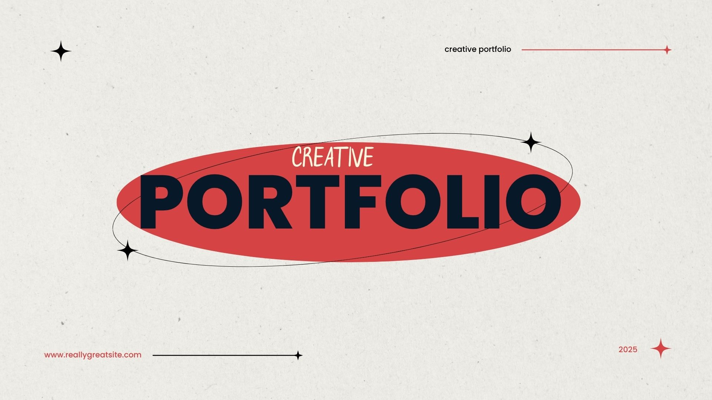
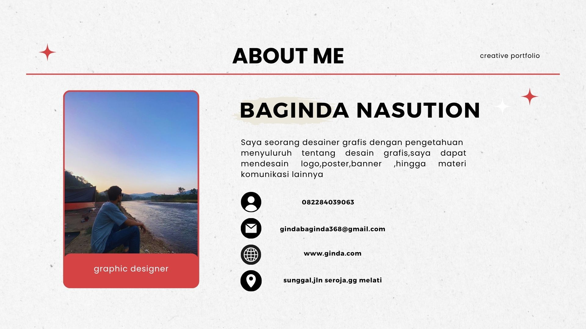
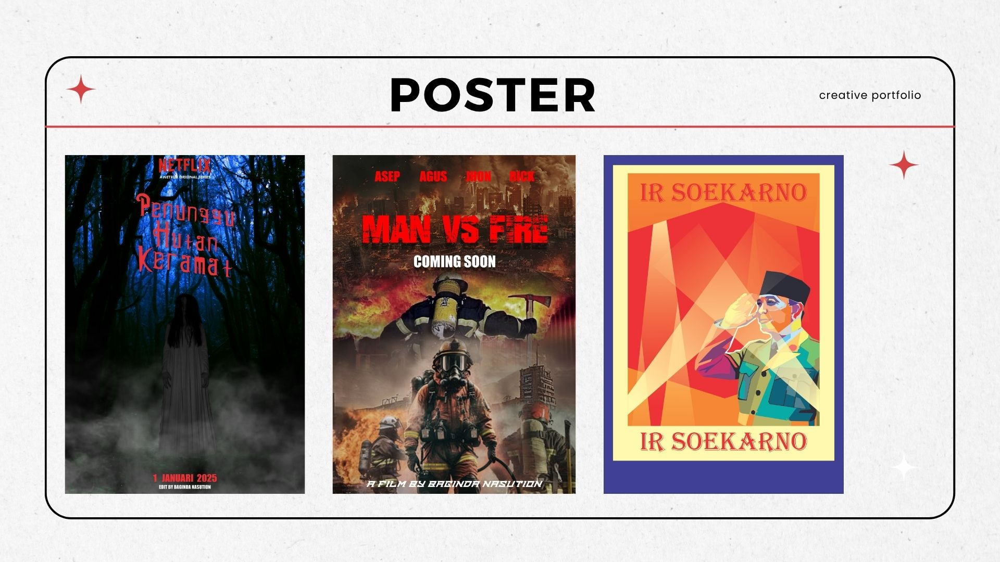
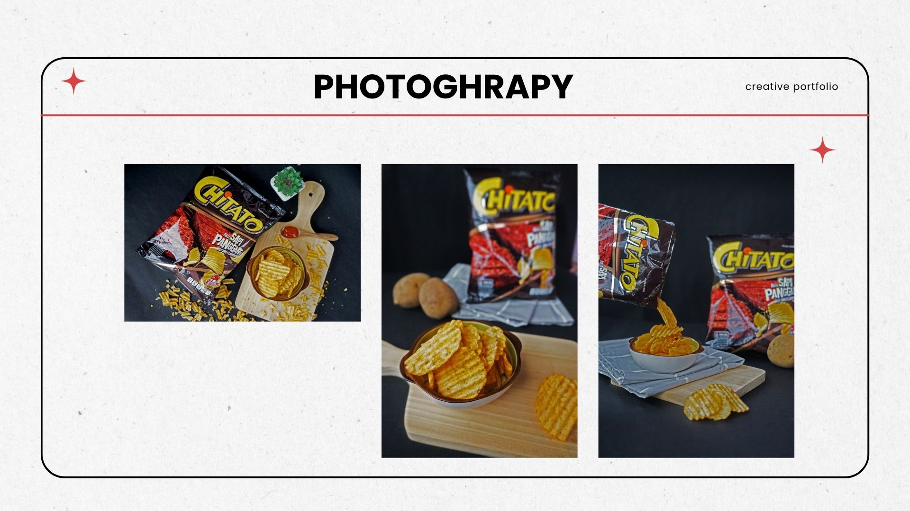
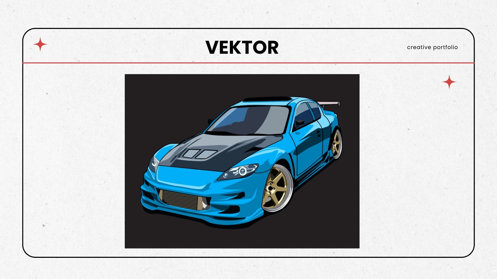
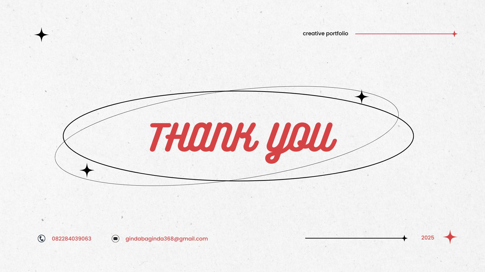

<!DOCTYPE html>
<html lang="id">
  <head>
    <meta charset="UTF-8">
    <meta name="viewport" content="width=device-width, initial-scale=1.0">
    <title>Portofolio Baginda Nasution</title>
    
  </head>
  <body>
    <h1>Selamat Datang di Website Portofolio Baginda Nasution</h1>
    
Halo! Saya Baginda Nasution, selamat datang di website portofolio saya.

    

      
      
      
      
      
      
    

  </body>
</html>
